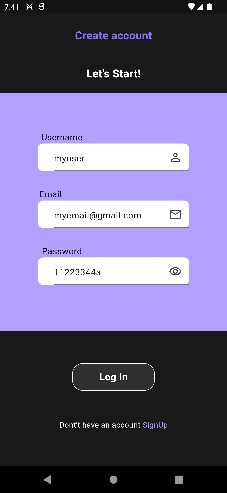
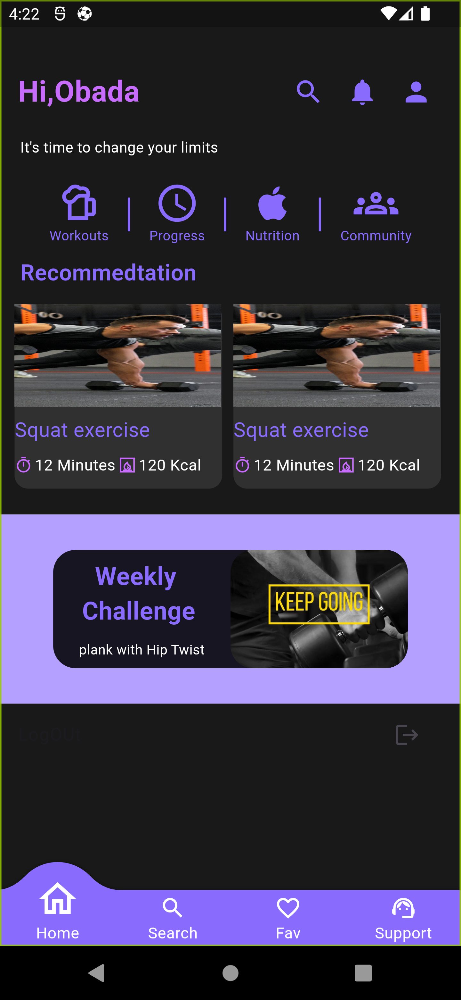
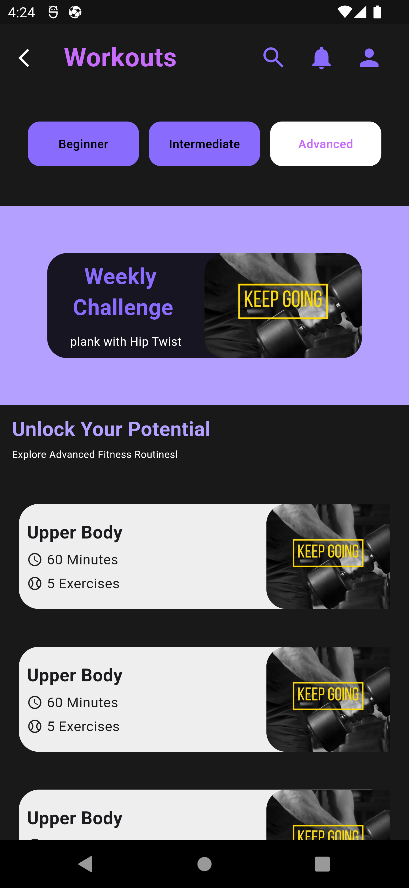

# 🏋️ Gym Project

## 📝 Description
**Gym Project** is a fitness-focused app designed for people who want to build their bodies and take better care of themselves. The app connects users with coaches who can create personalized workout routines and diet programs. It also features a notification system to help users stay on track with their fitness goals.

---

## 🚀 Features
- Coaches can create **workout routines** tailored to each user's needs.
- Personalized **diet programs** for users to follow.
- A **notification feature** to remind users of their workouts, diet schedules, and other updates.

---

## 📸 Screenshots
| Register Screen                                             | Home Screen                                             | Workout Screen                                             |
|-------------------------------------------------------------|---------------------------------------------------------|------------------------------------------------------------|
|  |  |  |

---

## 🛠️ Tools & Libraries
- [Flutter SDK](https://flutter.dev)
- [Cubit for State Management](https://pub.dev/packages/flutter_bloc)
- [Local Notifications](https://pub.dev/packages/flutter_local_notifications)

---

## 🔧 Setup & Installation
1. Clone this repository:
   ```bash
   git clone https://github.com/YourUsername/gym-project.git
